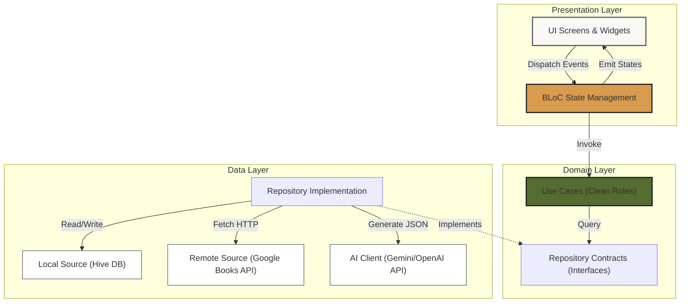

# Lume — AI-Powered Book Tracking Application

> **Lume** is a minimalist mobile application developed with **Flutter** for iOS, designed to cultivate a consistent reading habit. By integrating smart notification schedules, a personal local library manager, and an advanced AI-driven recommendation system, Lume transforms how bibliophiles discover, track, and reflect on their reading journeys.

---

## Visual Identity: The "Neo-Bibliophile" Aesthetic

Lume rejects the clinical, cold styling of modern transactional apps, opting instead for a cozy, sophisticated **"Neo-Bibliophile"** design. It blends the structural precision and card-based elevation of modern interfaces with the warmth and texture of physical libraries.

```
                  ┌─────────────────────────────────────────┐
                  │           Midnight Ink (#111622)        │  <-- Dark accent / Hero headers
                  │     L  U  M  E                          │
                  ├─────────────────────────────────────────┤
                  │                                         │
                  │       My Library                        │  <-- Instrument Serif typography
                  │                                         │
                  │  ┌───────────────────────────────────┐  │
                  │  │     Reading Now                   │  │  <-- Parchment White (#FAF8F5) body
                  │  │                                   │  │
                  │  │  [Warm Amber (#D99B4E) Progress] │  │  <-- Soft drop shadows & border-radii
                  │  └───────────────────────────────────┘  │
                  │                                         │
                  └─────────────────────────────────────────┘
```

### Design System & Theme Tokens

| Color Token | Hex Code | Visual Application & Purpose | Psychology & Vibe |
| :--- | :--- | :--- | :--- |
| **Parchment Background** | `#FAF8F5` | Main screen backdrop, scaffold base | Eye-friendly, mimics warm premium paper pages. |
| **Midnight Ink** | `#111622` | Hero sections, headers, onboarding | Premium contrast, mimics rich printer's ink. |
| **Warm Amber** | `#D99B4E` | Selection chips, progress bars, active icons | Invokes candlelit reading and aged leather. |
| **Sage Leaf** | `#556B2F` | "Finished" book tags, success indicators | Organic, represents growth and milestone achievement. |
| **Linen Card** | `#FFFFFF` | Core dashboard cards, interactive containers | Crisp, tactile contrast layer over parchment. |
| **Charcoal Gray** | `#4A5260` | Secondary copy, metadata labels, body text | Soft, highly readable without harshness. |

*   **Typography Hierarchy**:
    *   **Editorial Serif**: *Instrument Serif* / *Playfair Display* via Google Fonts (for brand logos, titles, and book covers).
    *   **Geometric Sans-Serif**: *Plus Jakarta Sans* / *Outfit* via Google Fonts (for stats, metadata, form fields, and navigation).
*   **Tactile Interfaces**: Features custom-drawn drop shadows (`blurRadius: 24.0`, `spreadRadius: -4.0`), hairline borders, and extreme rounded corners (`20.0` to `24.0` pixels) to give a physical, deck-of-cards feel.

---

## Core Features

### 1. Library Management (Kanban Organization)
Organize your literary world into three distinct shelves:
*   **Reading Now**: Keep track of current books and update page progress using interactive progress bars.
*   **Finished**: An archive of completed milestones, acting as your personal reading accomplishments history.
*   **Wishlist (Want to Read)**: Queue future books and plan upcoming adventures.
*   *Interactive State Transitions*: Drag-and-drop elements and tap actions animate smoothly with implicit micro-animations when you move books between shelves.

### 2. Real-Time Book Discovery
*   Directly search millions of titles worldwide via the **Google Books API**.
*   Examine rich, high-fidelity metadata including authors, publication years, genre labels, synopses, and high-resolution cover arts.
*   Filter lists instantly with tactile search tags and suggestion chips.

### 3. AI-Driven Literary Oracle
*   Analyzes your reading history, preferences, and genres from your **Finished** and **Reading Now** categories.
*   Streams your reading profiles through an LLM service (Google Gemini or OpenAI GPT) to build a complex literary profile of your taste.
*   Generates highly personalized book recommendations complete with detailed explanations of *why* they fit your profile.

### 4. The "Habit Builder"
*   Configure custom daily push notifications to remind you to read.
*   Dynamically crafts encouraging reminders featuring titles of books currently on your *Reading Now* shelf.
*   Utilizes local notifications (`flutter_local_notifications`) for robust offline reliability without any persistent cloud sync requirements.

---

## Architecture & Technical Stack

Lume is designed following rigid **Clean Architecture** patterns to keep components isolated, testable, and highly maintainable:

```
lib/
├── core/
│   ├── constants/       # Global constants & assets
│   └── theme/           # Playfair & Plus Jakarta theme definitions
├── data/
│   ├── datasources/     # Local storage (Hive) & Remote APIs (Google Books, Gemini)
│   ├── models/          # Data transfer objects & Hive TypeAdapters
│   └── repositories/    # Repository implementations (Hive + API mappings)
├── domain/
│   ├── entities/        # Pure business data models (Book, Recommendation)
│   ├── repositories/    # Abstract repository contracts
│   └── usecases/        # Core business rules (CRUD library, Search books, Fetch AI tips)
├── presentation/
│   ├── bloc/            # State management (LibraryBloc, SearchBloc, RecommendationBloc)
│   ├── screens/         # High-fidelity Neo-Bibliophile UI screens
│   └── widgets/         # Reusable design system widgets (BookCard, EmptyState)
└── services/
    └── notification_service.dart # Local scheduled notifications
```

### Technical Data Flow (BLoC Pattern)



---

## Setup & Installation

Follow these steps to set up and run Lume on your local developer workstation.

### Prerequisites
*   **Flutter SDK**: `^3.9.2` (or above) installed and added to your path.
*   **Dart SDK**: Matches the environment constraint.
*   **iOS Simulator** (Xcode) or **Android Emulator** setup.

### Step 1: Clone the Repository & Navigate
```bash
git clone https://github.com/your-username/lume.git
cd lume
```

### Step 2: Configure Environment Variables
Copy `.env.example` to create your own configuration:
```bash
cp .env.example .env
```
Open the `.env` file and input your API keys:
```env
GOOGLE_BOOKS_API_KEY="your_google_books_api_key_here"
GEMINI_API_KEY="your_gemini_api_key_here"
# OR if you choose to integrate OpenAI:
OPENAI_API_KEY="your_openai_api_key_here"
```

### Step 3: Fetch Dependencies
Download the Flutter package ecosystem dependencies:
```bash
flutter pub get
```

### Step 4: Run the Build Runner (Hive Codegen)
Generate the required Hive databases local models adapters:
```bash
flutter pub run build_runner build --delete-conflicting-outputs
```

### Step 5: Launch the Application
Start the application on your connected emulator/device:
```bash
# To run on the default active device/simulator
flutter run

# To run specifically on iOS
flutter run -d ios
```

---

## Principal Packages & Modules

*   **State Management**: `flutter_bloc` / `bloc` paired with `bloc_concurrency` for rock-solid reactive states.
*   **Local Storage**: `hive_ce` and `hive_ce_flutter` for lighting fast local offline persistence.
*   **Daily Reminders**: `flutter_local_notifications` for managing complex notification scheduling queues offline.
*   **Network Operations**: `http` for fetching metadata.
*   **Design & Typography**: `google_fonts` to load *Playfair Display*, *Instrument Serif*, *Plus Jakarta Sans*, and *Outfit* fluidly.
*   **Image Caching**: `cached_network_image` for seamless cover-art network image caching.

---

## License
This project is licensed under the MIT License - see the LICENSE file for details.

---